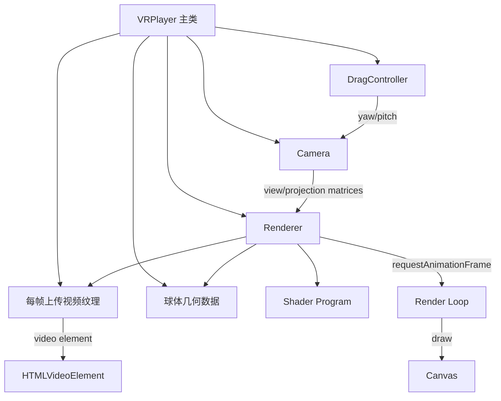

## 产品概述

一个开源的轻量级 VR 全景视频播放器 npm 插件。播放器将 360° 全景视频以视频纹理贴附到内表面球体上，相机位于球心，用户通过拖动转动视角来浏览全景画面。仅保留 FOV（视野角度）作为最基础的配置项。

## 核心功能

- 加载并播放 360° 全景视频源（支持 video 元素可播放的格式）
- 拖动交互：水平拖动改变 yaw（偏航角），垂直拖动改变 pitch（俯仰角），pitch 自动钳制在 ±85° 防止翻转
- FOV 视野角度配置：支持初始化时设置及运行时动态调整
- 播放控制：play / pause / load
- 资源管理：destroy 释放 WebGL 上下文、事件监听器、视频元素等全部资源
- 自适应容器尺寸变化（ResizeObserver 自动重设画布与投影矩阵）

## 视觉效果

- 全景视频以球面内壁贴图形式呈现，画面无缝包裹视野
- 拖动时视角平滑跟随，无延迟感
- FOV 调整实时反映画面缩放（视野变大变小）

## Tech Stack Selection

| 类别 | 选型 | 说明 |
| --- | --- | --- |
| 构建工具 | Rollldown | 用户指定，基于 Rust 的高速打包器，支持 ESM+CJS 双格式输出 |
| 语言 | TypeScript (strict) | 用户指定，类型安全 |
| 代码规范 | Biome | 用户指定，集 lint+format 一体化，零配置快速上手 |
| 测试 | Vitest | 补充建议，与 TS/ESM 原生兼容，适合测试 mat4 矩阵运算等纯函数 |
| 版本管理 | Changesets | 补充建议，开源 npm 包标准版本管理与 CHANGELOG 生成 |
| 渲染 | 原生 WebGL 1.0 | 用户确认不使用 Three.js，自行实现球体几何+着色器+相机矩阵，追求最小包体积 |
| 数学库 | 自实现 mat4 | 不引入 gl-matrix，仅实现所需函数（identity/multiply/perspective/yawPitch），保持零运行时依赖 |


## Implementation Approach

### 渲染核心思路

1. **球体几何**：程序化生成 UV 球（经纬度细分，如 64×32），顶点法线朝内（因相机在球心观察内表面）。生成 position/uv/indices 三个 buffer。
2. **视频纹理**：创建 `<video>` 元素，每帧通过 `gl.texImage2D`（首帧）或 `gl.texSubImage2D`（后续帧）将视频帧上传为 WebGL 纹理。设置 `UNPACK_FLIP_Y_WEBGL = true` 修正 UV 方向。
3. **相机系统**：yaw/pitch 欧拉角控制朝向，FOV 控制透视投影。视图矩阵 = yaw 绕 Y 轴旋转 × pitch 绕 X 轴旋转；投影矩阵 = 标准 perspective(fov, aspect, near, far)。
4. **拖动交互**：Pointer Events 统一处理鼠标/触摸。deltaX → yaw 增量，deltaY → pitch 增量，乘以灵敏度系数。pitch 钳制在 ±85°。
5. **渲染循环**：requestAnimationFrame 驱动，每帧检查视频是否有新帧（currentTime 变化）再上传纹理，避免无效上传。

### 关键技术决策与权衡

- **纯 WebGL vs Three.js**：用户明确选择轻量。自实现约 +500 行 GL 代码，换取包体积 < 15KB（gzip），零运行时依赖。
- **WebGL 1.0 vs 2.0**：选用 WebGL 1.0。全景视频播放不需要 WebGL 2.0 高级特性，1.0 兼容性更广（覆盖所有现代浏览器）。
- **texSubImage2D vs texImage2D**：首帧用 texImage2D 分配纹理内存，后续帧用 texSubImage2D 做区域更新，避免每帧重新分配，减少 GPU 内存碎片。
- **帧率纹理上传优化**：记录上次上传的 `video.currentTime`，仅当值变化时才上传，避免同一帧重复上传。
- **无 inertia/damping**：保持简易，拖动即响应，无惯性滑动。如后续需要可通过配置项扩展。

### 性能要点

- 球体几何 buffer 在初始化时一次性创建，渲染循环中仅 bind 不重建
- 纹理上传做 dirty check（currentTime 对比），避免 60fps 无效上传
- Render loop 中不产生任何对象分配（矩阵复用预分配 Float32Array），避免 GC
- ResizeObserver 防抖处理，避免高频 resize 风暴

## Implementation Notes

- **纹理格式**：视频纹理统一使用 `RGBA` + `UNSIGNED_BYTE`，兼容性最佳。不依赖视频的 actual format。
- **自动播放策略**：video 元素默认 `muted: true` + `playsinline: true`，满足浏览器自动播放策略。`play()` 需返回 Promise 并处理 NotAllowedError。
- **WebGL 上下文丢失**：监听 `webglcontextlost` 事件，阻止默认行为并标记需重建；`webglcontextrestored` 时重建 program/buffers/textures。首版可仅做事件监听 + 日志，完整恢复可后续迭代。
- **销毁完整性**：destroy() 必须清理：RAF 取消、Pointer 事件解绑、ResizeObserver disconnect、WebGL 纹理/buffer/program 删除、video 元素 pause+src 清空、canvas 从 DOM 移除。
- **Biome 配置**：使用推荐规则集，额外开启 `noUnusedImports` / `useImportType`，保持代码整洁。

## Architecture Design

### 系统架构



### 模块职责

| 模块 | 职责 |
| --- | --- |
| **VRPlayer** | 公共 API 入口，编排各模块生命周期，管理 load/play/pause/setFov/destroy |
| **Renderer** | WebGL 上下文管理、Shader 编译链接、Render Loop、Canvas resize |
| **SphereGeometry** | 程序化生成球体顶点/UV/索引数据，创建并绑定 GL buffers |
| **Camera** | 管理 yaw/pitch/fov，计算 view 与 projection 矩阵 |
| **VideoTexture** | 创建 video 元素、管理 WebGL 纹理对象、每帧 dirty check 上传 |
| **DragController** | Pointer 事件监听、delta → yaw/pitch 转换、pitch 钳制 |
| **mat4** | 纯函数矩阵运算：identity/multiply/perspective/rotationYawPitch |


### 数据流

用户拖动 → DragController 更新 yaw/pitch → Camera 重新计算 view matrix → 下一次 RAF → Renderer 绘制 → Canvas 呈现新视角

## Directory Structure

```
vr/
├── src/
│   ├── index.ts                    # [NEW] 库入口，导出 VRPlayer 类与 VRPlayerOptions 类型
│   ├── VRPlayer.ts                 # [NEW] 主类，编排 Renderer/Camera/VideoTexture/DragController 生命周期，实现 load/play/pause/setFov/getFov/destroy
│   ├── types.ts                    # [NEW] VRPlayerOptions 接口定义，VRPlayerEventMap 事件类型
│   ├── core/
│   │   ├── Renderer.ts             # [NEW] WebGL 上下文获取、Shader 编译、Program 链接、Render Loop 管理、Canvas resize 处理
│   │   ├── SphereGeometry.ts       # [NEW] 程序化生成 UV 球体顶点/UV/索引数据，创建 GL buffer 并提供 draw 调用
│   │   ├── Camera.ts               # [NEW] 管理 yaw/pitch/fov 状态，提供 getViewMatrix/getProjectionMatrix，pitch 钳制 ±85°
│   │   ├── VideoTexture.ts         # [NEW] 创建 video 元素，管理 WebGL 纹理，每帧 dirty check + texSubImage2D 上传
│   │   └── DragController.ts       # [NEW] Pointer 事件绑定，delta→yaw/pitch 转换，灵敏度系数，pointer capture
│   ├── math/
│   │   └── mat4.ts                 # [NEW] 纯函数 mat4 运算：identity/multiply/perspective/rotationYawPitch，预分配 Float32Array
│   └── shaders/
│       ├── vertex.glsl.ts          # [NEW] 顶点着色器源码字符串，输出 projection*view*position，传递 uv
│       └── fragment.glsl.ts        # [NEW] 片段着色器源码字符串，采样 video texture 输出颜色
├── tests/
│   ├── mat4.test.ts                # [NEW] mat4 纯函数单元测试：perspective 矩阵正确性、multiply 结合律、旋转矩阵正交性
│   ├── Camera.test.ts              # [NEW] Camera 测试：pitch 钳制边界、fov 上下限、矩阵更新正确性
│   └── SphereGeometry.test.ts      # [NEW] 球体几何测试：顶点数量、索引数量、UV 范围 [0,1]
├── demo/
│   ├── index.html                  # [NEW] 本地调试页面，含 canvas 容器与简易控制面板（FOV 滑块、播放/暂停按钮）
│   └── main.ts                     # [NEW] demo 入口，实例化 VRPlayer 并加载测试视频源
├── .github/
│   └── workflows/
│       └── ci.yml                  # [NEW] GitHub Actions CI：biome check + vitest run + rollldown build
├── .changeset/
│   └── config.json                 # [NEW] Changesets 配置，changelog 自动生成
├── package.json                    # [NEW] 项目元信息，exports 双格式入口，scripts（build/test/lint/dev）
├── tsconfig.json                   # [NEW] TypeScript 配置，strict 模式，lib: DOM/ES2020
├── biome.json                      # [NEW] Biome lint+format 配置
├── rolldown.config.ts              # [NEW] Rollldown 构建配置，ESM+CJS 双格式，external 无依赖
├── vitest.config.ts                # [NEW] Vitest 配置，environment: node（纯函数测试无需 DOM）
├── .gitignore                      # [NEW] 忽略 node_modules/dist/.turbo 等
├── LICENSE                         # [NEW] MIT 开源协议
├── README.md                       # [NEW] 项目说明、安装、API 文档、使用示例、Demo 截图
└── CONTRIBUTING.md                 # [NEW] 贡献指南
```

## Key Code Structures

### VRPlayerOptions 与 VRPlayer 公共 API

```typescript
// src/types.ts
export interface VRPlayerOptions {
  /** 挂载容器元素，播放器 canvas 将插入其中 */
  container: HTMLElement;
  /** FOV 视野角度（度），默认 75，范围 [30, 120] */
  fov?: number;
  /** 是否自动播放，默认 false */
  autoPlay?: boolean;
  /** 是否静音，默认 true（浏览器自动播放策略要求） */
  muted?: boolean;
  /** 是否循环播放，默认 false */
  loop?: boolean;
}

// src/VRPlayer.ts
export class VRPlayer {
  constructor(options: VRPlayerOptions);
  /** 加载视频源并初始化渲染管线 */
  load(src: string): Promise<void>;
  /** 播放视频 */
  play(): Promise<void>;
  /** 暂停视频 */
  pause(): void;
  /** 设置 FOV 视野角度（度），范围 [30, 120] */
  setFov(fov: number): void;
  /** 获取当前 FOV */
  getFov(): number;
  /** 销毁播放器，释放全部资源 */
  destroy(): void;
}
```

### Camera 核心接口

```typescript
// src/core/Camera.ts
export class Camera {
  private yaw: number;    // 弧度
  private pitch: number;  // 弧度，钳制 ±85°
  private fov: number;    // 弧度

  setYawPitch(yaw: number, pitch: number): void;
  setFov(fovDeg: number): void;
  getViewMatrix(out: Float32Array): void;
  getProjectionMatrix(aspect: number, out: Float32Array): void;
}
```

### mat4 纯函数签名

```typescript
// src/math/mat4.ts
export function identity(out: Float32Array): Float32Array;
export function multiply(out: Float32Array, a: Float32Array, b: Float32Array): Float32Array;
export function perspective(out: Float32Array, fovRad: number, aspect: number, near: number, far: number): Float32Array;
export function rotationYawPitch(out: Float32Array, yaw: number, pitch: number): Float32Array;
```