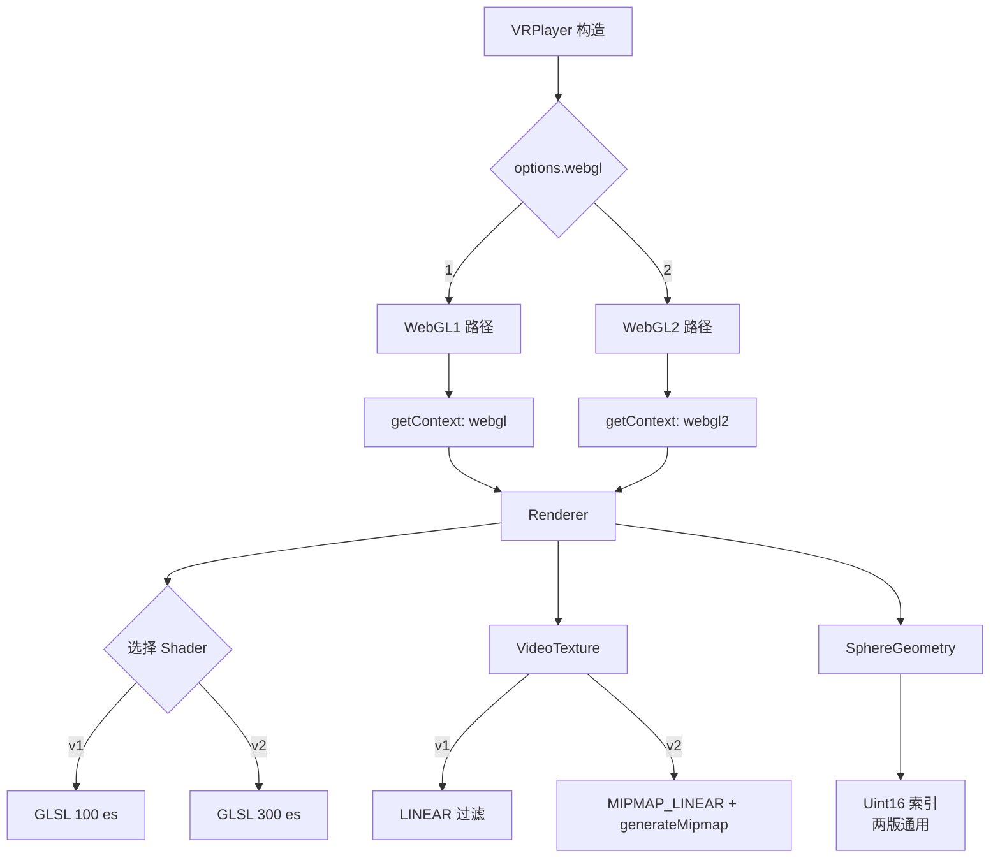

## 产品概述

为 VRPlayer 新增 WebGL 版本配置项，支持用户在 WebGL 1.0 和 WebGL 2.0 之间选择，两套渲染管线按需使用。

## 核心功能

- 新增 `webgl` 配置项（可选值 `1` | `2`），默认值为 `2`
- 两套渲染路径：Renderer、VideoTexture、SphereGeometry、Shader 均按版本适配
- WebGL2 模式下启用 NPOT mipmap + 三线性过滤（`LINEAR_MIPMAP_LINEAR`），显著提升清晰度
- 若用户选择 WebGL2 但浏览器不支持，自动降级到 WebGL1 并给出 console warning
- Demo 页面新增 WebGL 版本切换控件

## 技术栈

- TypeScript（纯前端）
- WebGL 1.0 / WebGL 2.0 双版本支持
- GLSL 100 es（WebGL1）/ GLSL 300 es（WebGL2）双套 Shader

## 实现方案

### 核心策略：运行时分支 + 联合类型

采用**策略模式**思想，在 VRPlayer 构造时根据 `options.webgl` 决定走哪条渲染路径。核心模块不拆分文件，而是通过**联合类型 + 运行时 if/else 分支**在同一模块内处理两版差异。

### 关键技术决策

1. **GL 上下文类型统一化**：定义 `WebGL = WebGLRenderingContext | WebGL2RenderingContext` 类型别名，所有下游模块使用此类型
2. **Shader 双套源码**：vertex.glsl.ts 和 fragment.glsl.ts 各导出两个常量（WebGL1 / WebGL2），Renderer 在编译时根据版本选择
3. **纹理过滤差异化**：

- WebGL1：`LINEAR` 过滤（无 mipmap，NPOT 不兼容）
- WebGL2：`LINEAR_MIPMAP_LINEAR` 三线性过滤 + 每帧 `generateMipmap()`

4. **自动降级**：若请求 WebGL2 失败，自动回退 WebGL1 并 console.warn
5. **向后兼容**：默认值 `webgl: 2`，未传该字段时行为不变（只是升级到更好的渲染器）

## 架构设计



## 目录结构

```
src/
├── types.ts                          # [MODIFY] 新增 webgl?: 1 | 2 字段
├── VRPlayer.ts                       # [MODIFY] 合并 webgl 默认值，传递给 Renderer
├── core/
│   ├── Renderer.ts                   # [MODIFY] 双版本上下文获取、Shader 选择
│   ├── VideoTexture.ts               # [MODIFY] 联合类型 + WebGL2 mipmap 分支
│   ├── SphereGeometry.ts             # [MODIFY] 参数类型改为联合类型
│   └── DragController.ts             # 无需修改
└── shaders/
    ├── vertex.glsl.ts                # [MODIFY] 导出双版本 shader
    └── fragment.glsl.ts              # [MODIFY] 导出双版本 shader

demo/
├── index.html                        # [MODIFY] 新增 WebGL 版本选择 UI
└── main.ts                           # [MODIFY] 传递 webgl 参数
```

## 关键代码结构

### types.ts 变更

```ts
export interface VRPlayerOptions {
  container: HTMLElement;
  fov?: number;
  muted?: boolean;
  loop?: boolean;
  /** WebGL 版本，1 或 2，默认 2 */
  webgl?: 1 | 2;
}
```

### Shader 导出变更（vertex.glsl.ts）

```ts
// 保留原有 WebGL1 shader
export const VERTEX_SHADER_SOURCE = /* glsl */ `...`; // attribute/varying

// 新增 WebGL2 shader（GLSL 300 es）
export const VERTEX_SHADER_SOURCE_300 = /* glsl */ `
#version 300 es
in vec3 aPosition;
in vec2 aUv;
out vec2 vUv;
uniform mat4 uProjection;
uniform mat4 uView;
void main() { vUv = aUv; gl_Position = uProjection * uView * vec4(aPosition, 1.0); }
`;
```

### Renderer.ts 核心：上下文获取与类型

```ts
type WebGLContext = WebGLRenderingContext | WebGL2RenderingContext;

export class Renderer {
  readonly canvas: HTMLCanvasElement;
  readonly gl: WebGLContext;
  /** 当前 WebGL 版本 */
  readonly webglVersion: 1 | 2;
  
  constructor(container: HTMLElement, camera: Camera, webglVersion: 1 | 2 = 2) {
    this.webglVersion = webglVersion;
    // 尝试请求指定版本，失败则降级
    this.gl = this.acquireContext(container);
    // 根据 webglVersion 选择对应版本的 shader
    const vsSource = webglVersion === 2 ? VERTEX_SHADER_SOURCE_300 : VERTEX_SHADER_SOURCE;
    const fsSource = webglVersion === 2 ? FRAGMENT_SHADER_SOURCE_300 : FRAGMENT_SHADER_SOURCE;
    this.program = this.createProgram(vsSource, fsSource);
    ...
  }
  
  private acquireContext(container: HTMLElement): WebGLContext {
    const ctxType = this.webglVersion === 2 ? 'webgl2' : 'webgl';
    let gl = container.querySelector('canvas')?.getContext(ctxType, {...});
    // 降级逻辑...
  }
}
```